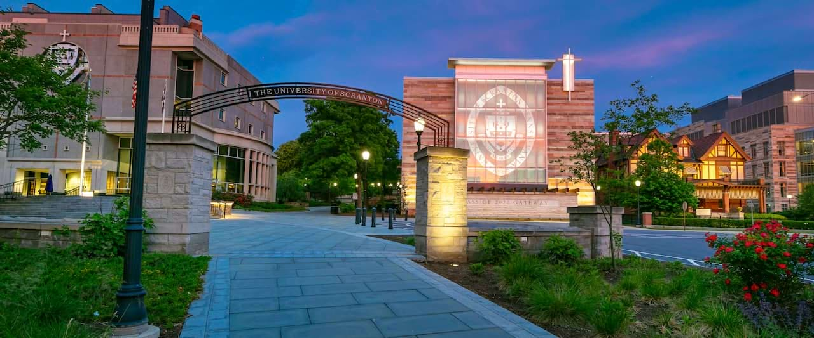

 

 

Schedule for Data Science Day on __Thursday, November 21__ at Room 407 in The DeNaples Center.

- 8:30-9:30 Registration and breakfast.  Please try getting here closer to 8:30 so we can get everybody set up with a Chromebook for the competition.

- 9:30-10:30 Introduction and tutorial by Joe Klobusicky - Assistant Professor of Mathematics

- 10:30-12:00 The 2024 Data Science Competition

- 12:00-1:00 Lunch and keynote speaker Melinda Kleczynski: Postdoctoral scholar at the National Institute of Standards and Technology: Applied and Computational Mathematics Division

- 1:00-1:30 Results and closing remarks

Use link [here](https://forms.gle/yUMwLqqePbmzuBxq8)

Second link [here](https://docs.google.com/forms/d/e/1FAIpQLScDk1HYcadsX0bWaSNxuOn3DnxEs4qjqyl2cRLZQzGHh-62FA/viewform?usp=sf_link)
  
  

