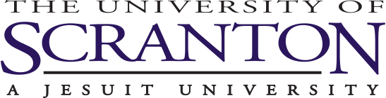
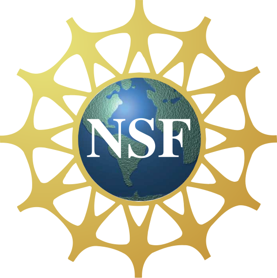

{width=100%}

 

Welcome to the homepage for the second annual The University of Scranton's Data Science Day! The event will take place on Thursday, November 13 from 8:30-1:30 at The DeNaples Center ballroom (room 407).

This year's schedule of events boasts:

- A tutorial on data processing in R
- A keynote address from Stephen Sorokanich, a Quantum Fellow at Air Force Research Laboratory
- The inaugural Scranton Data Science Day Competition, with a Pairs Division for beginners and a Singles Division for the computationally ambitious
- Plenty of food and data science swag for all who participate!  

For the singles division, we are offering a prize of $200 for the winner of the competition __and also a \$2500 scholarship to the University of Scranton__! We are also offering a prize of \$100 for the winning team of the doubles division, meant for beginners.  

If you are interested in participating in Data Science Day, please fill out the __registration form__ [here](https://docs.google.com/forms/d/e/1FAIpQLSePKA5Sdi9VW9YopJlrZHWHJTgyDDIYBQLa3ruEtIApkNfFYw/viewform?usp=sf_link).

If you have any questions about Data Science Day, please email the event coordinator, Prof. Joe Klobusicky, at joseph.klobusicky \<at\> scranton \<dot\> edu. 

Funding for Data Science Day is provided through National Science Foundation and The University of Scranton. 

{width=20%} {width=15%}

  